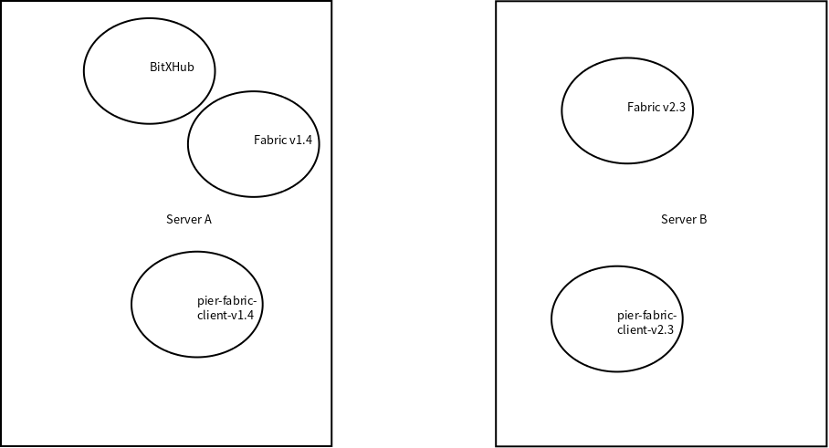

# Pier Client Fabric

This is fabric v2.3's bitxhub-pier-plugins of bitxhub implemented based on v1.4's bitxhub-pier-plugins and v2.3's chaincode and client. 

We only implemented data_swapper function of chaincode, which can fetch data from one chain to another chain.

If you have any question, please contact me via zekdot@163.com

## How to build whole network

We have tested on fabricv1.4 and fabric2.3. We use two 2C4G server to test and deploy all components in following figure.



Here is all process of build enviroment.

### Start bitxhub

After clone project from GitHub. Execute following code to start a single node relay-chain.

```sh
cd bitxhub
git checkout v1.0.0-rc1
cd scripts
bash solo.sh
```

When seeing this, the relay-chain is ready.

```
=9091
INFO[02:51:12.642] Order is ready                                module=app plugin_path=plugins/solo.so

=======================================================
    ____     _    __    _  __    __  __            __
   / __ )   (_)  / /_  | |/ /   / / / /  __  __   / /_
  / __  |  / /  / __/  |   /   / /_/ /  / / / /  / __ \
 / /_/ /  / /  / /_   /   |   / __  /  / /_/ /  / /_/ /
/_____/  /_/   \__/  /_/|_|  /_/ /_/   \__,_/  /_.___/

=======================================================

```

### Start fabric1.4

We use fabric v1.4.7, most steps is similar to BitXHub's official tutorial and we encapsulate them into a shell scripts which can start up network faster after modify some parameter.

We suggest that you start a new fabric1.4 chain to test our project.

This is my workspace's construct, `*` is what you should also have:

```
├── bitsxhub*
├── contracts
├── crypto-config
├── fabric-samples*
├── pier*
├── pier-client-fabric*
├── bootstrap.sh
├── chaincode.sh
├── configB.yaml
├── config-template.yaml
├── config.yaml
├── ERRO
├── fabric_rule.wasm
├── ffn.sh
├── prepare_pier.sh
├── prepare_pier_tips.sh
└── run_fabric1.4.sh
```

After deal with fabric1.4's enviroment according fabric's official tutorial. Put `njuscripts/run_fabric1.4.sh` to your workspace and modify following parameter to accommodate to your situation.

* WORKSPACE It's where you work, you should also put this script here.
* FABRIC_SAMPLE_PATH It's fabric-samples's path. fabric-samples is cloned from GitHub.
* PIER_CLIENT_PATH BitXHub's official pier-client-fabric project cloned from GitHub.

Use following command to startup fabric1.4 network and deploy cross-chain chaincode.

```sh
bash run_fabric1.4.sh
```

When seeing this, fabric1.4 is ready.

```
****************************************************************************************************
****************************************************************************************************
***** |  Response[0]:
***** |  |  Payload: set status of chaincode mychannel&data_swapper to 1
***** |  Response[1]:
***** |  |  Payload: set status of chaincode mychannel&data_swapper to 1
****************************************************************************************************
CONTAINER ID   IMAGE                                                                                             	...
"orderer"                3 minutes ago        Up 3 minutes        0.0.0.0:7050->7050/tcp, :::7050->7050/tcp       orderer.example.com

```

If you need stop network, run following command.

```sh
cd fabric-samples/first-network
./byfn.sh down
```

### Start pier1.4

Before start, make sure `pier` command is ready.

```sh
git clone https://github.com/meshplus/pier
git checkout v1.0.0-rc1
cd pier
make install
```

If run `pier` and get prompt, `pier` is ready.

```sh
xy@xy:~/bitxhub/fabric-samples/first-network$ pier
NAME:
   Pier - Manipulate the crosschain node

USAGE:
   pier [global options] command [command options] [arguments...]

VERSION:
```

Copy `njuscripts/prepare_pier1.4.sh`  and `fabric_rule.wasm` to your workspace.

Modify `prepare_pier1.4.sh` 's parameter to accommodate to your situation.

* WORKSPACE It's where you work, you should also put this script here.
* PIER_CLIENT_PATH BitXHub's official pier-client project cloned from GitHub.
* BITXHUB_PATH BitXHub's official relay-chain project cloned from GitHub.

Run `bash prepare_pier1.4.sh` to prepare pier.

```sh
xy@xy:~/bitxhub$ bash prepare_pier1.4.sh 
HEAD is now at f245bb5 Merge pull request #12 from meshplus/feat/add-dockerfile
mkdir -p build
GO111MODULE=on go build --buildmode=plugin -o build/fabric-client-1.4.so ./*.go
appchain register successfully, id is 0x739ca51e1edb218133d9fa87eb04833ec355fa77
Deploy rule to bitxhub successfully
pier is ready, address is 0x739ca51e1edb218133d9fa87eb04833ec355fa77, you need to save this value for send cross-chain request
run following code to start pier
pier --repo=/home/xy/.pier start
```

According the output, pier address is `0x739ca51e1edb218133d9fa87eb04833ec355fa77`, run following code to start pier.

```sh
pier --repo=/home/xy/.pier start
```

When seeing this. pier is ready:

```
6 module=syncer
INFO[04:15:56.916] Persist interchain tx wrapper                 count=0 height=7 module=syncer
INFO[04:15:56.916] Persist interchain tx wrapper                 count=0 height=8 module=syncer
INFO[04:15:56.916] Persist interchain tx wrapper                 count=0 height=9 module=syncer
INFO[04:15:56.916] Syncer started                                bitxhub_height=9 current_height=9 module=syncer
INFO[04:15:56.916] Exchanger started                             module=exchanger
```

Relay-chain will also give some prompt:

```
26c1...f1debe height=9 module=executor
INFO[04:15:56.917] Add pier                                      id=0x739ca51e1edb218133d9fa87eb04833ec355fa77 module=router
```

### Start fabric2.3

Copy all `pier-client-fabric2.3` dir to your workspace.

We use fabric v2.3.0, most steps is similar to BitXHub's official tutorial and we encapsulate them into a shell scripts which can start up network faster after modify some parameter.

We suggest that you start a new fabric2.3 chain to test our project.

This is my workspace's construct, `*` is what you should also have:

```
.
├── fabric-samples *
├── pier *
├── pier-client-fabric2.3 *
├── fabric_rule.wasm
├── genesis.json
├── prepare_fabric2.3_pier.sh
└── README.md

```

Copy `njuscrips/run_fabric2.3.sh`to your workspace and modify it's parameter according your situation:

* WORKSPACE It's where you work, you should also put this script here.
* FABRIC_SAMPLE_PATH It's fabric-samples's path. fabric-samples is cloned from GitHub.
* PIER_CLIENT_PATH It's our project's path

Run the following command to start fabric2.3 network and deploy cross-chain chaincode.

```sh
bash run_fabric2.3.sh
```

It will take a little long time. When seeing this, fabric 2.3 chain is ready.

```
2022-02-16 06:28:33.538 UTC [chaincodeCmd] ClientWait -> INFO 002 txid [2ca42d97dedba13353be35356eaf1674d59bf3829d0d2d825aba5b9f67b33eb2] committed with status (VALID) at localhost:9051
Committed chaincode definition for chaincode 'broker' on channel 'mychannel':
Version: 1.0, Sequence: 1, Endorsement Plugin: escc, Validation Plugin: vscc, Approvals: [Org1MSP: true, Org2MSP: true]
2022-02-16 06:28:36.585 UTC [chaincodeCmd] chaincodeInvokeOrQuery -> INFO 001 Chaincode invoke successful. result: status:200
```

### Start broker-invoked service

Copy `broker_service` to your workspace.

enter broker_service and modify `main.go`.

```go
	reqConfig := &Fabric{
		Addr:        "localhost:7053",
		OrganizationsPath:        "/home/zekdot/bitxhub/fabric-samples/test-network/organizations",
		Username:    "appuser",
		CCID:        "broker",
		ChannelId:   "mychannel",
	}
```

Modify `OrganizationsPath` to your own situation. 

Run the following command to start service.

```sh
rm -r wallet
rm -r keystore
go mod init broker_service
go mod tidy
go mod vendor
go run *.go
```

When seeing this, broker-invoked service is ready.

```
zekdot@172-19-240-22:~/bitxhub/broker_service$ go run *.go
2022/02/16 06:19:28 ============ application-golang starts ============
 [fabsdk/core] 2022/02/16 06:19:28 UTC - cryptosuite.GetDefault -> INFO No default cryptosuite found, using default SW implementation
```

### Start pier2.3

Before start, make sure `pier` command is ready.

```sh
git clone https://github.com/meshplus/pier
git checkout v1.0.0-rc1
cd pier
make install
```

If run `pier` and get prompt, `pier` is ready.

```sh
zekdot@172-19-240-22:~/bitxhub$ pier
NAME:
   Pier - Manipulate the crosschain node

USAGE:
   pier [global options] command [command options] [arguments...]

VERSION:
   0.0.0
```

Copy `njuscripts/prepare_pier2.3.sh` and `fabric_rule.wasm` to your workspace.

Modify `prepare_pier2.3.sh` 's parameter to accommodate to your situation.

* WORKSPACE It's where you work, you should also put this script here.
* PIER_CLIENT_PATH It's our project's path
* FABRIC_SAMPLE_PATH It's fabric-samples's path. fabric-samples is cloned from GitHub.
* REMOTE_BITXHUB_PATH bitxhub url that deploy relay-chain
* REMOTE_IP relay-chain's server ip

Run `bash prepare_pier2.3.sh`

```sh
GO111MODULE=on go build --buildmode=plugin -o build/fabric2.3.so ./*.go
genesis.json                                  100%  223   141.7KB/s   00:00    
"0xf2d66e2c27e93ff083ee3999acb678a36bb349bb"
appchain register successfully, id is 0x2cb98405fedc08b4eead5ac697d34186818d765b
Deploy rule to bitxhub successfully
pier is ready, address is 0x2cb98405fedc08b4eead5ac697d34186818d765b, you need to save this value for send cross-chain request
run following code to start pier
pier --repo=/home/zekdot/.pier start
```

According the output, pier address is `0xf2d66e2c27e93ff083ee3999acb678a36bb349bb`, run following code to start pier.

```sh
pier --repo=/home/xy/.pier start
```

When seeing this. pier is ready:

```
29 module=syncer
INFO[06:30:10.840] Persist interchain tx wrapper                 count=0 height=30 module=syncer
INFO[06:30:10.840] Persist interchain tx wrapper                 count=0 height=31 module=syncer
INFO[06:30:10.840] Persist interchain tx wrapper                 count=0 height=32 module=syncer
INFO[06:30:10.840] Syncer started                                bitxhub_height=32 current_height=32 module=syncer
INFO[06:30:10.840] Exchanger started                             module=exchanger
```

Relay-chain will also give some prompt:

```
INFO[06:30:10.543] Persist block                                 count=1 hash=edb393...2b1abf height=32 module=executor
INFO[06:30:10.835] Add pier                                      id=0x2cb98405fedc08b4eead5ac697d34186818d765b module=router
```

## How to use

### Prepare data

Set value1 to key1 on fabric1.4 chain.  Set value2 to key2 on fabric2.3.

Run these commands to set value1 on fabric1.4, value of `WORKSPACE` is on your own situation:

```sh
export WORKSPACE=$HOME/bitxhub
export CONFIG_YAML=$WORKSPACE/config.yaml
export CONFIG_PATH=$WORKSPACE
fabric-cli chaincode invoke --cid mychannel --ccid="data_swapper" --args='{"Func":"set", "Args":["key1", "value1"]}'  --user Admin --orgid org2 --payload --config "${CONFIG_YAML}"
```

 Use following command to make sure value has been set.

```sh
export WORKSPACE=$HOME/bitxhub
export CONFIG_YAML=$WORKSPACE/config.yaml
export CONFIG_PATH=$WORKSPACE
xy@xy:~/bitxhub$ fabric-cli chaincode invoke --cid mychannel --ccid="data_swapper" --args='{"Func":"get", "Args":["key1"]}'  --user Admin --orgid org2 --payload --config "${CONFIG_YAML}"
****************************************************************************************************
***** |  Response[0]:
***** |  |  Payload: value1
***** |  Response[1]:
***** |  |  Payload: value1
****************************************************************************************************
```

Then set value2 on fabric2.3, run following commands:

```sh
export WORKSPACE=$HOME/bitxhub
export FABRIC_SAMPLE_PATH=$WORKSPACE/fabric-samples
export PIER_CLIENT_PATH=$WORKSPACE/pier-client-fabric2.3
export FABRIC_CFG_PATH=$FABRIC_SAMPLE_PATH/config/
export CORE_PEER_TLS_ENABLED=true
export ORDERER_CA=$FABRIC_SAMPLE_PATH/test-network/organizations/ordererOrganizations/example.com/orderers/orderer.example.com/msp/tlscacerts/tlsca.example.com-cert.pem
export PEER0_ORG1_CA=$FABRIC_SAMPLE_PATH/test-network/organizations/peerOrganizations/org1.example.com/peers/peer0.org1.example.com/tls/ca.crt
export PEER0_ORG2_CA=$FABRIC_SAMPLE_PATH/test-network/organizations/peerOrganizations/org2.example.com/peers/peer0.org2.example.com/tls/ca.crt
export PEER0_ORG3_CA=$FABRIC_SAMPLE_PATH/test-network/organizations/peerOrganizations/org3.example.com/peers/peer0.org3.example.com/tls/ca.crt
export ORDERER_ADMIN_TLS_SIGN_CERT=$FABRIC_SAMPLE_PATH/test-network/organizations/ordererOrganizations/example.com/orderers/orderer.example.com/tls/server.crt
export ORDERER_ADMIN_TLS_PRIVATE_KEY=$FABRIC_SAMPLE_PATH/test-network/organizations/ordererOrganizations/example.com/orderers/orderer.example.com/tls/server.key
export CHANNEL_NAME=mychannel
export CORE_PEER_LOCALMSPID="Org1MSP"
export CORE_PEER_TLS_ROOTCERT_FILE=$PEER0_ORG1_CA
export CORE_PEER_MSPCONFIGPATH=$FABRIC_SAMPLE_PATH/test-network/organizations/peerOrganizations/org1.example.com/users/Admin@org1.example.com/msp
export CORE_PEER_ADDRESS=localhost:7051

peer chaincode invoke -o localhost:7050 --ordererTLSHostnameOverride orderer.example.com --tls --cafile "$ORDERER_CA" -C $CHANNEL_NAME -n broker --peerAddresses localhost:7051 --tlsRootCertFiles $FABRIC_SAMPLE_PATH/test-network/organizations/peerOrganizations/org1.example.com/peers/peer0.org1.example.com/tls/ca.crt --peerAddresses localhost:9051 --tlsRootCertFiles $FABRIC_SAMPLE_PATH/test-network/organizations/peerOrganizations/org2.example.com/peers/peer0.org2.example.com/tls/ca.crt -c '{"function":"Set","Args":["key2", "value2"]}'
```

 Use following command to make sure value has been set.

```sh
export WORKSPACE=$HOME/bitxhub
export FABRIC_SAMPLE_PATH=$WORKSPACE/fabric-samples
export PIER_CLIENT_PATH=$WORKSPACE/pier-client-fabric2.3
export FABRIC_CFG_PATH=$FABRIC_SAMPLE_PATH/config/
export CORE_PEER_TLS_ENABLED=true
export ORDERER_CA=$FABRIC_SAMPLE_PATH/test-network/organizations/ordererOrganizations/example.com/orderers/orderer.example.com/msp/tlscacerts/tlsca.example.com-cert.pem
export PEER0_ORG1_CA=$FABRIC_SAMPLE_PATH/test-network/organizations/peerOrganizations/org1.example.com/peers/peer0.org1.example.com/tls/ca.crt
export PEER0_ORG2_CA=$FABRIC_SAMPLE_PATH/test-network/organizations/peerOrganizations/org2.example.com/peers/peer0.org2.example.com/tls/ca.crt
export PEER0_ORG3_CA=$FABRIC_SAMPLE_PATH/test-network/organizations/peerOrganizations/org3.example.com/peers/peer0.org3.example.com/tls/ca.crt
export ORDERER_ADMIN_TLS_SIGN_CERT=$FABRIC_SAMPLE_PATH/test-network/organizations/ordererOrganizations/example.com/orderers/orderer.example.com/tls/server.crt
export ORDERER_ADMIN_TLS_PRIVATE_KEY=$FABRIC_SAMPLE_PATH/test-network/organizations/ordererOrganizations/example.com/orderers/orderer.example.com/tls/server.key
export CHANNEL_NAME=mychannel
export CORE_PEER_LOCALMSPID="Org1MSP"
export CORE_PEER_TLS_ROOTCERT_FILE=$PEER0_ORG1_CA
export CORE_PEER_MSPCONFIGPATH=$FABRIC_SAMPLE_PATH/test-network/organizations/peerOrganizations/org1.example.com/users/Admin@org1.example.com/msp
export CORE_PEER_ADDRESS=localhost:7051

zekdot@172-19-240-22:~/bitxhub/fabric-samples/test-network$ peer chaincode invoke -o localhost:7050 --ordererTLSHostnameOverride orderer.example.com --tls --cafile "$ORDERER_CA" -C $CHANNEL_NAME -n broker --peerAddresses localhost:7051 --tlsRootCertFiles $FABRIC_SAMPLE_PATH/test-network/organizations/peerOrganizations/org1.example.com/peers/peer0.org1.example.com/tls/ca.crt --peerAddresses localhost:9051 --tlsRootCertFiles $FABRIC_SAMPLE_PATH/test-network/organizations/peerOrganizations/org2.example.com/peers/peer0.org2.example.com/tls/ca.crt -c '{"function":"Get","Args":["key2"]}'
2022-02-16 06:42:42.580 UTC [chaincodeCmd] chaincodeInvokeOrQuery -> INFO 001 Chaincode invoke successful. result: status:200 payload:"value2" 
```

### Fetch data from fabric1.4 to fabric2.3

Run this command on fabric2.3 to start a query request:

```sh
peer chaincode invoke -o localhost:7050 --ordererTLSHostnameOverride orderer.example.com --tls --cafile "$ORDERER_CA" -C $CHANNEL_NAME -n broker --peerAddresses localhost:7051 --tlsRootCertFiles $FABRIC_SAMPLE_PATH/test-network/organizations/peerOrganizations/org1.example.com/peers/peer0.org1.example.com/tls/ca.crt --peerAddresses localhost:9051 --tlsRootCertFiles $FABRIC_SAMPLE_PATH/test-network/organizations/peerOrganizations/org2.example.com/peers/peer0.org2.example.com/tls/ca.crt -c '{"function":"Get","Args":["0x739ca51e1edb218133d9fa87eb04833ec355fa77", "mychannel&data_swapper", "key1"]}'
```

The address `0x71c9330633bea2f130ac0d323895cf87bd36926c` is belong to fabric1.4 which can be gotten on previous step.

After run this command, pier2.3 will output these lines:

```
x739ca51e1edb218133d9fa87eb04833ec355fa77-1 index=1 module=executor type=RECEIPT
whole args is 
0x739ca51e1edb218133d9fa87eb04833ec355fa77!
1!
mychannel&broker!
key1!
value1!
funcName is  InterchainSet
content.DstContractId ID is mychannel&broker
content.Func is interchainSet
content.Args is 
key1!
value1!
INFO[06:46:13.620] Execute callback 
```

We can get key1's value on fabric2.3 now.

```sh
zekdot@172-19-240-22:~/bitxhub/fabric-samples/test-network$ peer chaincode invoke -o localhost:7050 --ordererTLSHostnameOverride orderer.example.com --tls --cafile "$ORDERER_CA" -C $CHANNEL_NAME -n broker --peerAddresses localhost:7051 --tlsRootCertFiles $FABRIC_SAMPLE_PATH/test-network/organizations/peerOrganizations/org1.example.com/peers/peer0.org1.example.com/tls/ca.crt --peerAddresses localhost:9051 --tlsRootCertFiles $FABRIC_SAMPLE_PATH/test-network/organizations/peerOrganizations/org2.example.com/peers/peer0.org2.example.com/tls/ca.crt -c '{"function":"Get","Args":["key1"]}'
2022-02-16 06:48:03.977 UTC [chaincodeCmd] chaincodeInvokeOrQuery -> INFO 001 Chaincode invoke successful. result: status:200 payload:"value1"
```

### Fetch data from fabric2.3 to fabric1.4

Run this command on fabric1.4 to start a query request:

```sh
fabric-cli chaincode invoke --cid mychannel --ccid=data_swapper  --args='{"Func":"get", "Args":["0xe391cc4f14c7902dd6ac2b991e457e527879d350", "mychannel&data_swapper", "key2"]}'     --user Admin --orgid org2 --payload --config "${CONFIG_YAML}"
```

The address `0xe391cc4f14c7902dd6ac2b991e457e527879d350` is belong to fabric2.3 which can be gotten on previous step.

Then we can query value of key2  on fabric1.4

```sh
xy@xy:~/bitxhub$ fabric-cli chaincode invoke --cid mychannel --ccid="data_swapper" --args='{"Func":"get", "Args":["key2"]}'  --user Admin --orgid org2 --payload --config "${CONFIG_YAML}"
****************************************************************************************************
***** |  Response[0]:
***** |  |  Payload: value2
***** |  Response[1]:
***** |  |  Payload: value2
****************************************************************************************************
```

Now we can get data from each other's chains.

